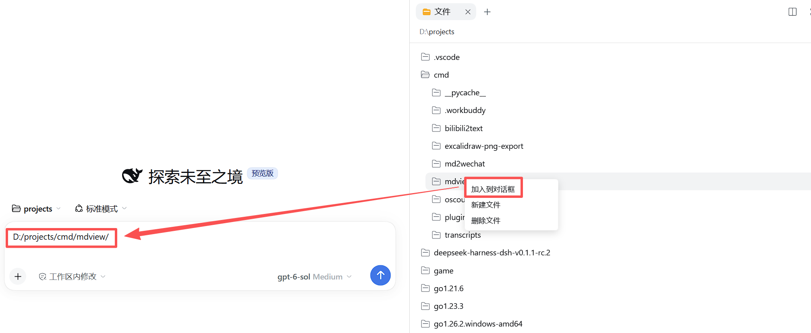

# DSH Plugins

这里收录 DeepSeek Harness（DSH）的扩展插件。目前包含：

| 插件 | 简介 | 文档 |
|---|---|---|
| **dsh-file-to-chat** | 在 DSH Web 文件树中将文件、文件夹或文本预览选中行引用插入当前对话草稿；不自动发送，也不读取或上传文件内容。 | [插件 README](dsh-file-to-chat/README.md) · [English](dsh-file-to-chat/README.en.md) |
| **dsh-file-write** | 在右侧预览编辑并保存 Markdown 等文本文件；在文件树右键创建或删除文件及目录，支持版本冲突防护。 | [插件 README](dsh-file-write/README.md) · [English](dsh-file-write/README.en.md) |
| **dsh-markdown** | 为 Markdown 预览添加可折叠目录，自动扫描标题，点击目录项可滚动到对应标题，并记住目录显示状态。 | [README](dsh-markdown/README.md) |

## 使用案例：将目录加入对话

在 DSH Web 的文件树中右键目标目录，选择“加入到对话框”，插件会把目录路径插入当前对话草稿。图中将 `mdview` 目录加入草稿后，可继续补充问题，再自行发送给 AI。

## 安装

各插件的安装、使用、限制与卸载说明见对应 README。

## English

This repository contains extensions for DeepSeek Harness (DSH).

| Plugin | Description | Documentation |
|---|---|---|
| **dsh-file-to-chat** | Insert a file, directory, or selected text-preview lines into the current DSH Web conversation draft. It does not send messages automatically or read and upload file contents. | [README](dsh-file-to-chat/README.en.md) |
| **dsh-file-write** | Edit and save Markdown and other text files in the right-hand preview. Create or delete files and directories from the file tree, with version-conflict protection. | [README](dsh-file-write/README.en.md) |
| **dsh-markdown** | Adds a persistent, collapsible table of contents to Markdown previews. It scans headings, scrolls to the selected heading, and remembers the TOC visibility state. | [README](dsh-markdown/README.md) |

## Installation

See each plugin's README for installation, usage, limitations, and uninstall instructions.
