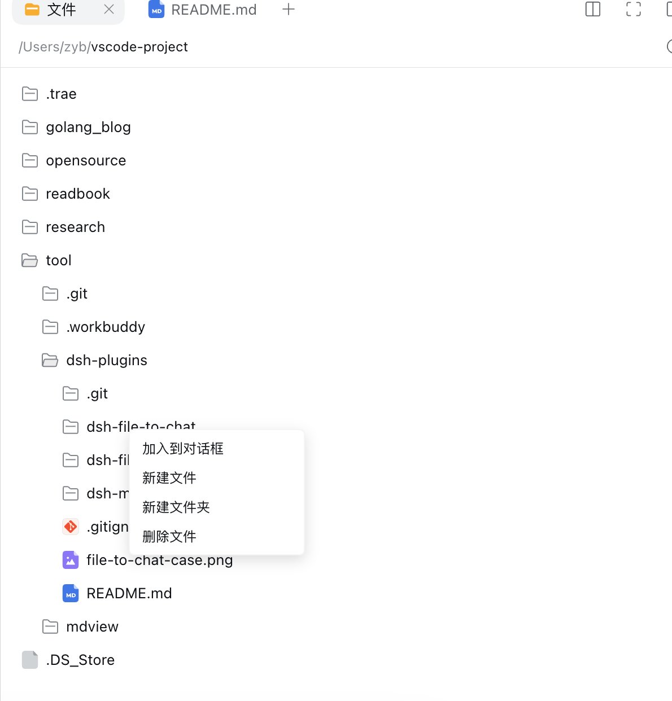

# DSH File Write

[简体中文](README.md)

A plugin for DeepSeek Harness Web `0.1.7-rc.1` that edits text files in the right-hand preview, creates and renames files or folders, or moves entries to the host OS Trash (Recycle Bin on Windows), from the workspace file tree.

## Usage

- Choose **编辑源文件** (Edit source) in the viewer selector to edit text files with automatic saving. `.md` and `.markdown` files use this source editor too.
- Trash labels follow the DSH Host OS, which can differ from the browser OS: Windows hosts display **移到回收站** (Move to Recycle Bin); other hosts display **移到废纸篓** (Move to Trash).
- Right-click a **directory** for **新建文件** (New file), **新建文件夹** (New folder), **重命名** (Rename), or **移到废纸篓** (Move to Trash); provide a single filename or folder name. Right-click a **regular file** for Rename or Move to Trash. Renaming changes only the basename, not the parent folder, and refuses an existing destination. Empty tree space has no such actions. Confirm before moving a file or folder; a folder moves together with all its contents and can be restored from macOS Trash or Windows Recycle Bin. A failed move never falls back to permanent deletion.
- Right-click a directory and choose **添加文件…** (Add files) to select one or multiple files; you may also drop files onto a folder row. After clicking a folder in the tree, Cmd+V (Ctrl+V on Windows) imports files only if the browser exposes them through the paste event. The **粘贴** (Paste) menu attempts to read clipboard images; copying files in Finder/Explorer is not reliably exposed by browsers. If no files are available, use Add files or drag-and-drop instead. Recursive folder imports are not supported.
- With `dsh-file-to-chat`, these actions join the existing context menu. The actions also work without that plugin.

## Example: folder context menu

Right-click a folder in the file tree to create a file or folder, or move it to Trash. This screenshot shows the older permanent-delete menu; the **加入到对话框** (Add to chat) option comes from the separately installed `dsh-file-to-chat` plugin.



## Install

```sh
dsh plugin --profile web add "/absolute/path/to/dsh-plugins/dsh-file-write"
```

Restart the current DSH Web process and refresh the page to load both the Host write service and browser editor. Uninstall with `dsh plugin --profile web remove dsh-file-write`.

## Safety and limits

- Writes to regular files and creation of single-level folders are restricted to the active session's workspace and respect its read-only policy. Names must be single basenames; no path separators or traversal. Folder creation requires a local filesystem backend; a hostile concurrent ancestor-symlink swap retains the same TOCTOU risk as deletion.
- Binary imports accept up to 512 MiB per file, upload in chunks and exclusively create the destination in an existing workspace folder without overwriting. Per-file results and cancellation are available; temporary files are removed on completion, failure, cancellation, or expiry. Import requires a local filesystem backend; a hostile concurrent ancestor-symlink swap remains a TOCTOU risk. Creation uses a create-if-absent operation, never overwriting another file. Rename checks for an existing destination, but Node's cross-platform `rename` is not an atomic no-replace operation: an external process creating the same name after the final check could still cause an overwrite. Avoid renaming under untrusted concurrent filesystem mutation. Saving checks the version observed when the document was opened; external changes cause a conflict and retain the draft.
- Only UTF-8 text without NUL bytes is supported, up to 2 MiB for both original and saved content. Large or binary files cannot be saved.
- Editing requires a complete file and version. Changes save automatically after about 600 ms of inactivity. A write failure or version conflict retains the draft and stops retries until the next edit. Drafts only survive for the current page lifetime; confirm the status says saved or copy your draft before refreshing or closing. Conflicts are not auto-merged.
- The Host checks the live session and workspace; read-only sessions cannot move entries; workspace roots, symlinks, and out-of-workspace targets are rejected. The `trash` package moves entries to the host OS Trash/Recycle Bin using a local filesystem backend; failure never triggers permanent deletion. Paths are rechecked before the move and the original path is verified absent afterwards. A hostile concurrent ancestor-symlink swap still presents a TOCTOU risk. Avoid moving folders in environments with untrusted concurrent filesystem mutation. On Windows service accounts, items may enter the service account's Recycle Bin rather than the desktop user's.

## Development

```sh
npm run build
npm test
```

`lib/index.js` implements Host mutations; `lib/client.js` registers the editor and new-file menu; `cordis.patch.yml` installs both in the Web profile.
