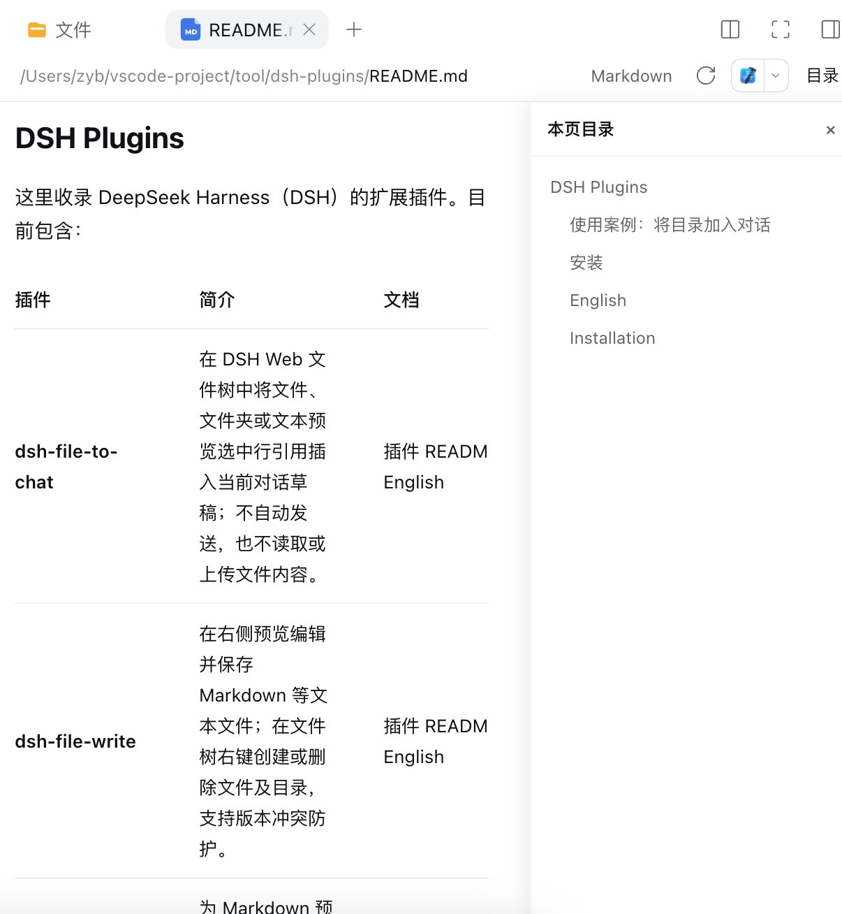

# DSH Markdown TOC

**DSH Markdown TOC** adds a persistent, collapsible table of contents to Markdown previews in DeepSeek Harness Web.

## Features

- Adds a `目录` button to Markdown preview actions.
- Scans rendered `h1`–`h6` headings from the current Markdown preview.
- Shows the TOC beside the preview without covering the document scrollbar. Drag its left edge to resize it (64 px minimum, up to the available preview width); the chosen width is remembered. The focused divider also supports ←/→ and Shift+←/→.
- Highlights the current section as you scroll and shows the document's reading progress.
- Clicking an item smoothly scrolls to its heading.
- Remembers whether the TOC is visible using browser local storage.
- Does not replace the built-in Markdown renderer.

## Example

Open a Markdown preview and click `目录` to show the current document's headings on the right. Click a heading to jump to it.



## Installation

```sh
dsh plugin --profile web add "$(pwd)"
```

Restart DSH Web and refresh the page if the plugin is not loaded automatically.

## Development

```sh
npm run build
npm test
```
